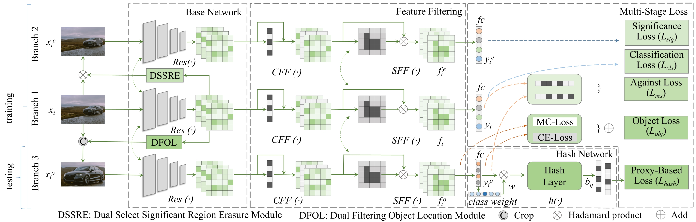

# MBLNet: Multi-Branch Learning Network for Fine-Grained Image Retrieval



This repository provides the official implementation of **MBLNet**, a novel and highly reliable fine-grained deep hashing learning framework for accurate image retrieval in the presence of significant intra-class variation and small inter-class differences. 

## 🌟 Highlights

- 🔁 We propose a novel and highly reliable fine-grained deep hash learning framework MBLNet, which addresses the issues of fine-grained feature mining, noisy feature filtering and low retrieval accuracy simultaneously.
- ✂️ a Dual-Selected Significant Region Erasure (DSSRE) method to enhance the generation of compact and discriminative binary hash codes.
- 🧭 a Dual Filtering Object Location (DFOL) strategy to mine discriminative local features and focus on object-relevant regions.
- 🔒 a new Multi-Stage Loss Function to guide effective network optimization.

## 📦 Repository Structure

```
MBLNet/
├── models/              # Network architecture definitions
├── datasets/            # Dataset loading and preprocessing
├── train.py             # Training script
├── test.py              # Inference and evaluation
├── utils/               # Helper functions
├── docs/
│   └── architecture.jpg # Network architecture diagram
└── README.md            # Project documentation
```
## 📈 Dataset Preparation

Stanford Cars: | [Download](https://pan.baidu.com/s/1a7wiMxwdzgWrRmK-clMDoA), extraction code：exw6.
Details

|--Stanford Cars 

    |--images 
       |--001...
       |--002... 
       ... 
    |--Stanford_Cars_train.txt 
    |--Stanford_Cars_test.txt

FGVC-Aircraft: | [Download](https://pan.baidu.com/s/1M3EmSjgqd5eW34C8_w44wA), extraction code：zvz5.
Details

|--FGVC-Aircraft 

    |--images 
       |--001...
       |--002... 
       ... 
    |--aircraft_train.txt 
    |--aircraft_test.txt
    
CUB-200-2011: | [Download](https://pan.baidu.com/s/1wesLfqIZsoxhCBuVRa8Sag), extraction code：qqv4.
Details

|--CUB_200_2011 

    |--images 
       |--001...
       |--002... 
       ... 
    |--cub_bird_train.txt 
    |--cub_bird_test.txt

## 📊 Pretrained Models

| Dataset   | Model Link |
|-----------|------------|
| Stanford Cars | [Download](https://github.com/luhongchun/MBLNet/blob/master/pretrained/pth/Stanford_Cars_48bits_model.pt) |
| FGVC-Aircraft | [Download](https://github.com/luhongchun/MBLNet/blob/master/pretrained/pth/aircraft_48bits_model.pt) |
| CUB-200-2011  | [Download](https://github.com/luhongchun/MBLNet/blob/master/pretrained/pth/cub_bird_48bits_model.pt) |

> 📁 Please place downloaded models in the `./pretrained/pth/` directory.

## 🛠️ Installation

```bash
git clone https://github.com/luhongchun/MBLNet.git
cd MBLNet
pip install -r requirements.txt
```

## 🚀 Training

```bash
python train.py 
```
Modify the train file for different datasets or training settings.

## 📄 Citation

If you find this work useful, please cite:

```bibtex
@article{LU2025113833,
  title={MBLNet: Multi-Branch Learning Network for Fine-Grained Image Retrieval},
  author={Hongchun Lu, Min Han, Songlin He, Xue Li, Chase Wu},
  journal={Applied Soft Computing},
  volume = {185},
  pages = {113833},
  year={2025},
  doi = {https://doi.org/10.1016/j.asoc.2025.113833}
}
```


